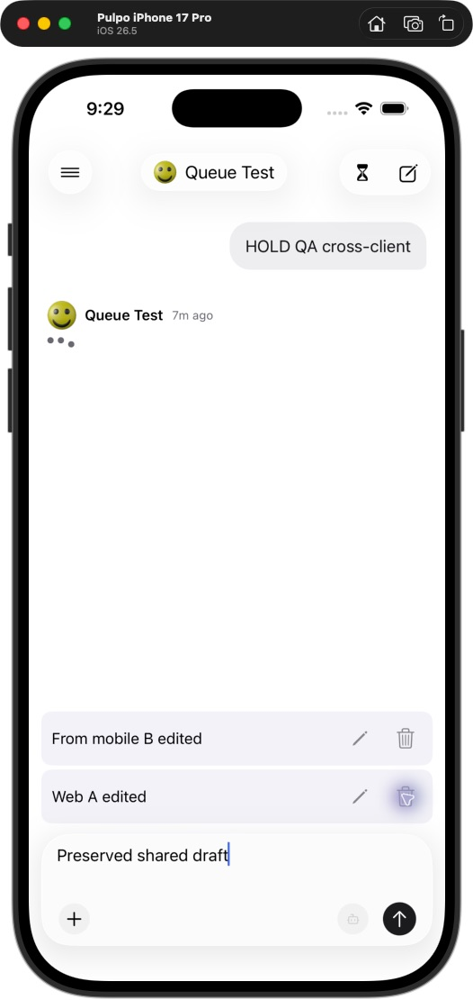
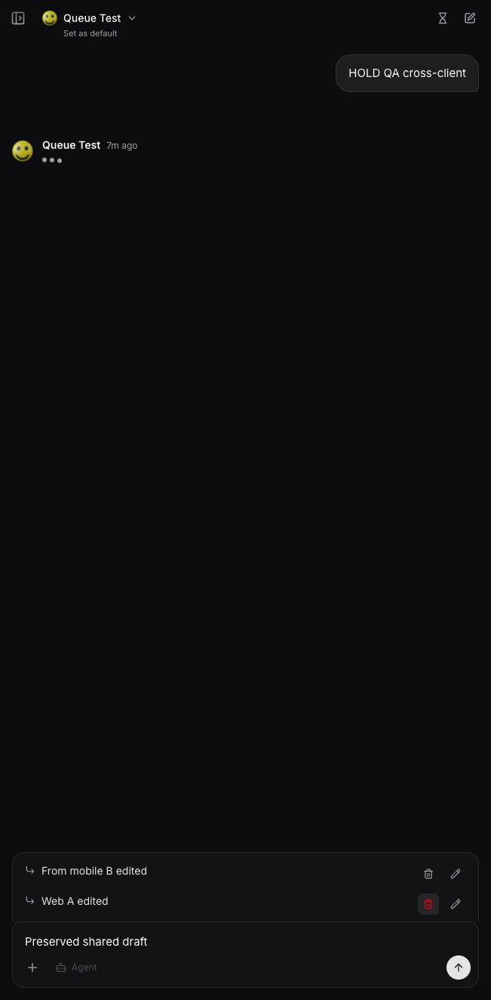
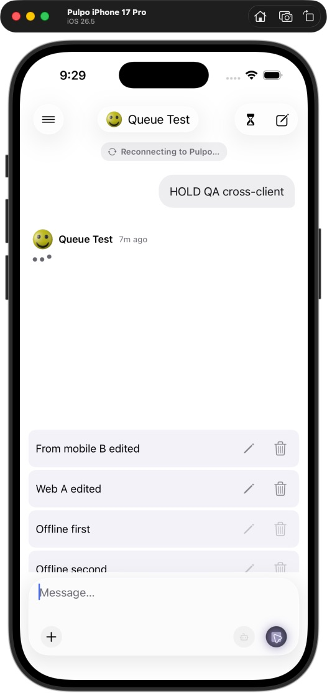
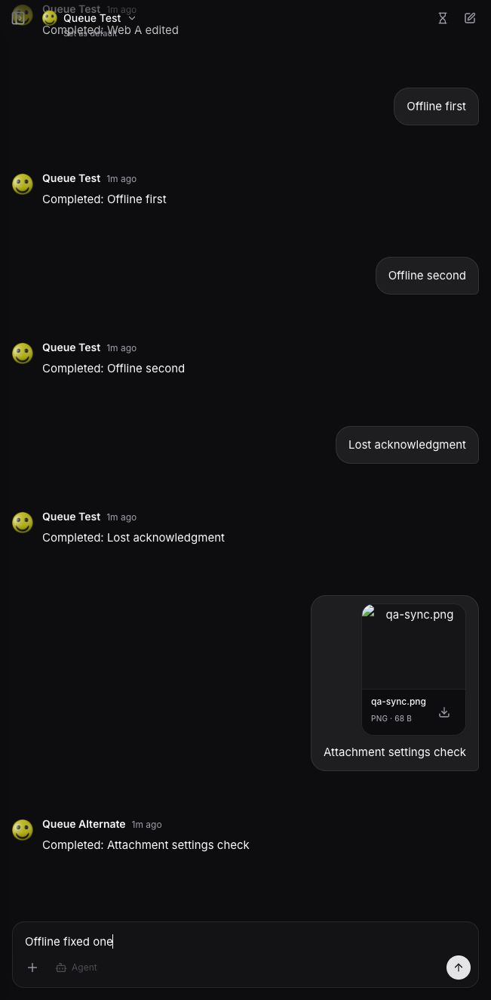

# Mobile/web queue QA — September 4, 2026

## Findings and fixes

Two failures were reproduced using the real local API, worker, PostgreSQL, Redis, and Socket.IO server:

1. **HTTP outbox replay was gated on a connected realtime socket.** With realtime blocked and a single injected API 503, mobile kept a disabled “Waiting to sync” item and made no retry even after HTTP recovered. Replay now runs independently of the socket when the app is active, including startup and foreground recovery. After rebuilding/relaunching with realtime still blocked, the pending item reached the server and appeared in web exactly once.
2. **Multiple offline sends overwrote the previous accepted-draft receipt.** The queue replayed correctly, but an earlier submitted draft could return to the shared composer on reconnect. Accepted receipts are now retained until reconciliation, and only a matching submitted draft is cleared. A regression test failed before the fix and passes afterward. Real Socket.IO testing with persisted checkpoints and a restarted client also passes, including preservation of a newer unsent remote draft.

An initial online send also left submitted text visible in the composer. It cleared after reconnect; the clean rebuild and later online/lost-acknowledgment sends cleared correctly. The repeatable multiple-offline-send case above is fixed; this run does not establish the precise cause of that first isolated observation or the user's production incident.

These fixes change mobile/shared client code. They do not deploy production. The original PR's server `clientId` deduplication change is still required for retry guarantees.

## Local setup

- iOS 26.5 iPhone 17 Pro simulator; current branch native build.
- Built web client at `http://localhost:8091`, signed into the same disposable account as mobile.
- Gateway 8091 proxies API 8094 and serves the built web app. Control port 8095 injects outages, disconnected sockets, rejected requests, or a dropped successful acknowledgment.
- Disposable database `pulpo_mobile_queue_e2e`, Redis 6391, deterministic Responses fixture 8092; no external model calls.

## Results

| Scenario | Actual result |
| --- | --- |
| Web enqueue → mobile | Passed; native queue appeared with no new transcript turn. |
| Mobile enqueue → web | Passed; web updated without reopening the chat. |
| Web edit, cancel, save → mobile | Passed; queue content/status synchronized and the normal draft remained intact. |
| Native edit, cancel, save → web | Passed; web showed the edit lock and saved content; original draft restored. |
| Native accessible reorder → web | Passed; order changed immediately on both clients. |
| Delete from either client | Passed; other client removed the same item. |
| HTTP failure with realtime unavailable | Reproduced stall; fixed and verified native HTTP recovery while sockets remained blocked. |
| Two offline submissions, then app termination/relaunch | Both replayed once and in original order, without requiring realtime to recover. |
| Multiple offline accepted drafts | Reproduced stale shared draft; regression and real Socket.IO restart tests pass after fix. Final native UI retest blocked by locked Mac. |
| Server accepts POST but response is lost | Native replay passed; one server queue item and one eventual transcript turn. Reusable API fault test also passes. |
| Rejected POST | Native alert displayed the server error, restored the complete draft, and removed optimistic queued state. |
| Edit lock during dispatch | Real API test passed: after the active response finishes, an editing head blocks later items; cancel resumes sequential dispatch. |
| Idle enqueue / retry after dispatch | Real API test passed; retries return null queue item without another response. |
| Attachment and saved model | Uploaded PNG queued through API appeared in web; dispatched input retained the image and Queue Alternate model. Native attachment edit/picker retest blocked. |
| Automatic dispatch / exact execution count | Passed: seven responses completed in expected order; no duplicates or remaining queue rows. Web displayed the completed transcript and empty queue. |
| Native press-and-hold dragging | Not verified: available automation cannot specify the required hold duration. Native accessibility reorder and API reorder are verified. |
| Agent mode, presets, temporary-chat restrictions, mutation rollback | Automated regression coverage; this native run used the non-agent fixture and empty presets. |

The Mac locked during testing and native UI automation requested a manual unlock. Remaining simulator checks were not represented as passes. Web and API checks continued successfully. No production server or physical iPhone deployment was performed during this QA run.

## Exact shared-chat execution

The active response plus six surviving queued messages completed once each:

1. `HOLD QA cross-client`
2. `From mobile B edited`
3. `Web A edited`
4. `Offline first`
5. `Offline second`
6. `Lost acknowledgment`
7. `Attachment settings check` (PNG + alternate model)

Machine-readable evidence: [shared-chat assertions](evidence/qa-sync-results.json), [fault/race assertions](evidence/qa-fault-results.json), [real Socket.IO recovery assertions](evidence/qa-composer-results.json).

## Automated checks

- Full repository suite passed with `NODE_OPTIONS=--no-experimental-webstorage npm test` (local Node 26 workaround documented in validation.md).
- Includes 319 mobile, 399 web, 666 server, and 42 shared client tests.
- Four new outbox scheduling tests and three new accepted-draft recovery tests (including legacy checkpoint migration).
- Mobile typecheck, iOS export, native simulator build, repository lint, and diff whitespace check passed.

## Screenshots

