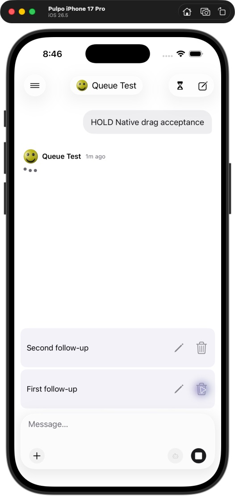
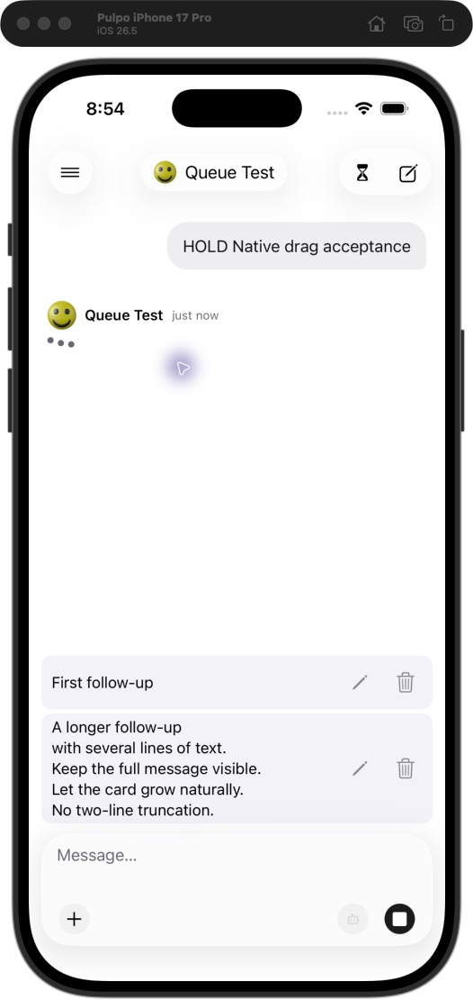

# Mobile queue validation — September 4, 2026

## Automated validation

- Mobile typecheck and iOS export passed.
- Mobile suite: 315 tests passed, including 19 new queue/outbox tests.
- Full repository build and lint passed. Full repository tests passed with `NODE_OPTIONS=--no-experimental-webstorage npm test`.
- Unmodified `npm test` under local Node 26.4 initially failed 8 existing web composer-sync tests because Node’s global `localStorage` was undefined. Disabling experimental web storage lets jsdom supply it. CI uses Node 24.18.1; the affected web code matches `origin/dev`.
- Focused web queue tests (6), server queue-policy tests (5), and contracts tests (56) also passed.
- Real API/worker acceptance passed: concurrent submission deduplication, edit/cancel/save, deletion, reordering, sequential completion, saved alternate model, and a duplicate retry after dispatch.

## Native end-to-end run

Built the current branch and tested in the iOS 26.5 iPhone 17 Pro simulator against an isolated database/API/worker and local deterministic Responses fixture.

- Sent follow-ups while a response was active; queued rows appeared without transcript turns. Empty composer showed Stop; typing showed Send.
- Edited and cancelled a queued message with an existing draft. Both cancel and save restored the draft. Reordered two queued messages and deleted the selected item.
- Stopped the test API, reopened the cached conversation offline, and submitted the preserved draft. It appeared as **Waiting to sync**. Relaunched and restarted the API; the item reconciled to one server queue entry.
- Added an uploaded PNG from a second authenticated API client. Mobile received it through realtime updates. Opening its edit selected Queue Alternate and retained the image; saving restored the original Queue Test composer model.
- Released the held turn. API assertions verified exactly four completed responses in order: `HOLD Native acceptance`, `Native second`, `Preserve my draft`, and `Image from second client`. The final provider input retained the image and alternate model. Mobile displayed the completed transcript and an empty queue.

A separate web UI run created a held response and queued follow-up, then edited it in the browser. The open mobile chat received the saved edit without reopening. Native photo selection was not exercised. Agent flag/preset preservation and rejection recovery were covered by automated tests; the deterministic native run used non-agent models. No physical iPhone deployment was performed.

## Screenshots

## Native queue UI refinement

Replaced queue metadata and text/arrow controls with UIKit cards, SF Symbol pencil/trash buttons, and UITableView long-press drag/drop. VoiceOver exposes Move up/Move down actions; edit locks and pending submissions disable mutation controls.

Revalidated on the iOS 26.5 simulator: pencil opens editing, cancel and save restore an existing draft, trash removes the selected queued message, and native accessibility reordering persists to the API. Releasing the fixture produced exactly three completed turns in order: `HOLD Native drag acceptance`, `Second follow-up edited`, `First follow-up`. The queue disappeared and the draft remained intact.

**Touch-drag validation limitation:** the available UI automation exposes drag without a configurable press-and-hold duration. Its attempted drag did not lift a row. The UIKit drag/drop implementation compiles, but the actual long-press lift/drop gesture still needs manual verification. Accessibility reordering exercised the same native move and server reconciliation path successfully.

Mobile tests (315), mobile typecheck, iOS export, simulator build, repository lint, full repository tests with the Node web-storage workaround above, and isolated API acceptance all passed for this refinement.

Compact layout follow-up: reduced standard queue rows from 80 to 56 points, halved vertical padding, and set action symbols to 14 points while preserving 44-point button targets. Rows size to their content. Visually checked the updated layout on the iOS 26.5 simulator and refreshed the screenshot above; mobile typecheck, repository lint, and the native simulator build passed.

Dynamic sizing follow-up: removed text/detail line limits and connected the native table's measured content height to the queue container. Short cards stay compact; multiline cards expand and the container grows up to its existing scroll limit. In the iOS 26.5 simulator, verified a one-line and five-line card together with no truncation, then removed the long card and confirmed the container shrank without leftover space. Mobile typecheck, repository lint, and native simulator build passed.

The subsequent [detailed mobile/web QA report](qa-sync-report.md) records reproduced recovery failures, their fixes, current test counts, actual cross-client results, and remaining native UI limitations.
