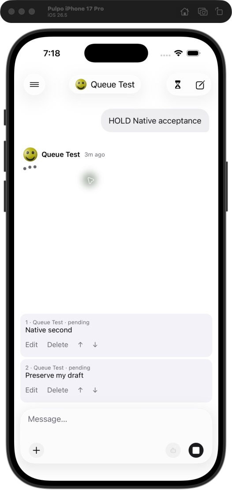
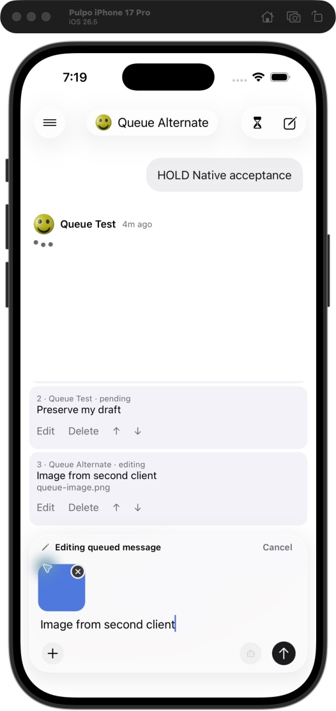
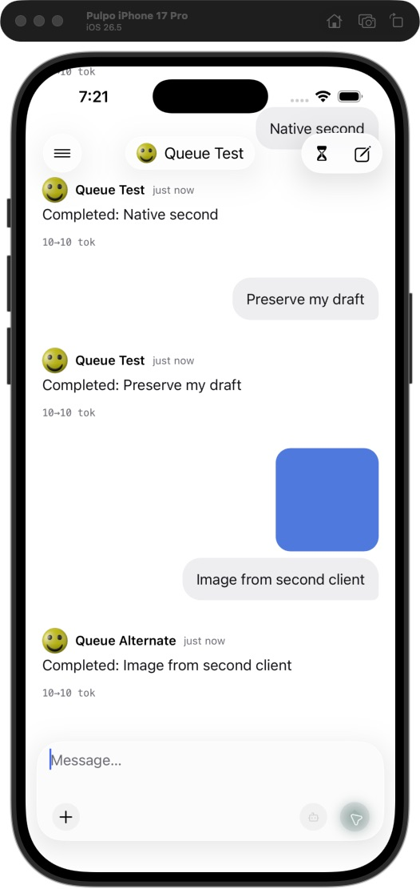

# Mobile queue validation — September 4, 2026

## Automated validation

- Mobile typecheck and iOS export passed.
- Mobile suite: 315 tests passed, including 19 new queue/outbox tests.
- Full repository build and lint passed. Full repository tests passed with `NODE_OPTIONS=--no-experimental-webstorage npm test`.
- Unmodified `npm test` under local Node 26.4 initially failed 8 existing web composer-sync tests because Node’s global `localStorage` was undefined. Disabling experimental web storage lets jsdom supply it. CI uses Node 24.18.1; the affected web code matches `origin/dev`.
- Focused web queue tests (6), server queue-policy tests (5), and contracts tests (56) also passed.
- Real API/worker acceptance passed: concurrent submission deduplication, edit/cancel/save, deletion, reordering, sequential completion, saved alternate model, and a duplicate retry after dispatch.

## Native end-to-end run

Built the current branch and tested in the iOS 26.5 iPhone 17 Pro simulator against an isolated database/API/worker and local deterministic Responses fixture.

- Sent follow-ups while a response was active; queued rows appeared without transcript turns. Empty composer showed Stop; typing showed Send.
- Edited and cancelled a queued message with an existing draft. Both cancel and save restored the draft. Reordered two queued messages and deleted the selected item.
- Stopped the test API, reopened the cached conversation offline, and submitted the preserved draft. It appeared as **Waiting to sync**. Relaunched and restarted the API; the item reconciled to one server queue entry.
- Added an uploaded PNG from a second authenticated API client. Mobile received it through realtime updates. Opening its edit selected Queue Alternate and retained the image; saving restored the original Queue Test composer model.
- Released the held turn. API assertions verified exactly four completed responses in order: `HOLD Native acceptance`, `Native second`, `Preserve my draft`, and `Image from second client`. The final provider input retained the image and alternate model. Mobile displayed the completed transcript and an empty queue.

A separate web UI run created a held response and queued follow-up, then edited it in the browser. The open mobile chat received the saved edit without reopening. Native photo selection was not exercised. Agent flag/preset preservation and rejection recovery were covered by automated tests; the deterministic native run used non-agent models. No physical iPhone deployment was performed.

## Screenshots

